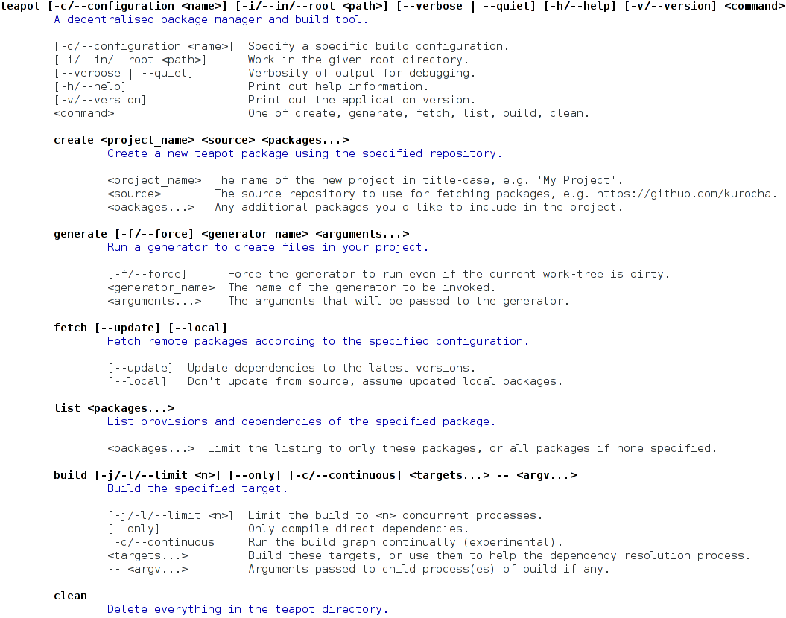

# Samovar

Samovar is a modern framework for building command-line tools and applications. It provides a declarative class-based DSL for building command-line parsers that include automatic documentation generation. It helps you keep your functionality clean and isolated where possible.

## Motivation

I've been using [Trollop](https://github.com/ManageIQ/trollop) and while it's not bad, it's hard to use for sub-commands in a way that generates nice documentation. It also has pretty limited support for complex command lines (e.g. nested commands, splits, matching tokens, etc). Samovar is a high level bridge between the command line and your code: it generates decent documentation, maps nicely between the command line syntax and your functions, and supports sub-commands using classes which are easy to compose.

One of the other issues I had with existing frameworks is testability. Most frameworks expect to have some pretty heavy logic directly in the binary executable, or at least don't structure your code in a way which makes testing easy. Samovar structures your command processing logic into classes which can be easily tested in isolation, which means that you can mock up and [spec your command-line executables easily](https://github.com/ioquatix/teapot/blob/master/spec/teapot/command_spec.rb).

## Installation

Add this line to your application's Gemfile:

	gem 'samovar'

And then execute:

	$ bundle

Or install it yourself as:

	$ gem install samovar

## Usage

### Basic Options

	require 'samovar'
	
	class Application < Samovar::Command
		options do
			option '-f/--frobulate <text>', "Frobulate the text"
			option '-x | -y', "Specify either x or y axis.", key: :axis
			option '-F/--yeah/--flag', "A boolean flag with several forms."
		end
	end
	
	application = Application.new(['-f', 'Algebraic!'])
	application.options[:frobulate] # 'Algebraic!'
	
	application = Application.new(['-x', '-y'])
	application.options[:axis] # :y
	
	application = Application.new(['-F'])
	application.options[:flag] # true

### Nested Commands

	require 'samovar'
	
	class Create < Samovar::Command
		def invoke(parent)
			puts "Creating"
		end
	end
	
	class Application < Samovar::Command
		nested '<command>',
			'create' => Create
		
		def invoke(program_name: File.basename($0))
			if @command
				@command.invoke
			else
				print_usage(program_name)
			end
		end
	end

	Application.new(['create']).invoke

### ARGV Splits

	require 'samovar'

	class Application < Samovar::Command
		many :packages
		split :argv
	end

	application = Application.new(['foo', 'bar', 'baz', '--', 'apples', 'oranges', 'feijoas'])
	application.packages # ['foo', 'bar', 'baz']
	application.argv # ['apples', 'oranges', 'feijoas']

### Parsing Tokens

	require 'samovar'
	
	class Application < Samovar::Command
		self.description = "Mix together your favorite things."
		
		one :fruit, "Name one fruit"
		many :cakes, "Any cakes you like"
	end

	application = Application.new(['apple', 'chocolate cake', 'fruit cake'])
	application.fruit # 'apple'
	application.cakes # ['chocolate cake', 'fruit cake']

### Real-world Examples

The best example of a working Samovar command line is probably [Teapot](https://github.com/ioquatix/teapot/blob/master/lib/teapot/command.rb).

[Utopia](https://github.com/ioquatix/utopia/blob/master/lib/utopia/command.rb) shows how to use multiple levels of nested commands.

Please feel free to submit other examples and I will link to them here.

## Contributing

1. Fork it
2. Create your feature branch (`git checkout -b my-new-feature`)
3. Commit your changes (`git commit -am 'Add some feature'`)
4. Push to the branch (`git push origin my-new-feature`)
5. Create new Pull Request

### Future Work

#### Line Wrapping

Line wrapping is done by the terminal which is a bit ugly in some cases. There is a [half-implemented elegant solution](lib/samovar/output/line_wrapper.rb).

#### Type Coercion

It might make sense to enforce constraints at parse time.. or not. For example, if an option is given like `--count <int>` we should probably parse an integer?

#### Multi-value Options

Right now, options can take a single argument, e.g. `--count <int>`. Ideally, we support a specific sub-parser defined by the option, e.g. `--count <int...>` or `--tag <section> <tags...>`. These would map to specific parsers using `Samovar::One` and `Samovar::Many` internally.

#### Global Options

Options can only be parsed at the place they are explicitly mentioned, e.g. a command with sub-commands won't parse an option added to the end of the command:

	command list --help

One might reasonably expect this to parse but it isn't so easy to generalize this:

	command list -- --help

In this case, do we show help? Some effort is required to disambiguate this. Initially, it makes sense to keep things as simple as possible. But, it might make sense for some options to be declared in a global scope, which are extracted before parsing begins. I'm not sure if this is really a good idea. It might just be better to give good error output in this case (you specified an option but it was in the wrong place).

#### Shell Auto-completion

Because of the structure of the Samovar command parser, it should be possible to generate a list of all possible tokens at each point. Therefore, semantically correct tab completion should be possible.

As a secondary to this, it would be nice if `Samovar::One` and `Samovar::Many` could take a list of potential tokens so that auto-completion could give meaningful suggestions, and possibly improved validation.

#### Short/Long Help

It might be interesting to explore whether it's possible to have `-h` and `--help` do different things. This could include command specific help output, more detailed help output (similar to a man page), and other useful help related tasks.

## License

Released under the MIT license.

Copyright, 2016, by [Samuel G. D. Williams](http://www.codeotaku.com/samuel-williams).

Permission is hereby granted, free of charge, to any person obtaining a copy
of this software and associated documentation files (the "Software"), to deal
in the Software without restriction, including without limitation the rights
to use, copy, modify, merge, publish, distribute, sublicense, and/or sell
copies of the Software, and to permit persons to whom the Software is
furnished to do so, subject to the following conditions:

The above copyright notice and this permission notice shall be included in
all copies or substantial portions of the Software.

THE SOFTWARE IS PROVIDED "AS IS", WITHOUT WARRANTY OF ANY KIND, EXPRESS OR
IMPLIED, INCLUDING BUT NOT LIMITED TO THE WARRANTIES OF MERCHANTABILITY,
FITNESS FOR A PARTICULAR PURPOSE AND NONINFRINGEMENT. IN NO EVENT SHALL THE
AUTHORS OR COPYRIGHT HOLDERS BE LIABLE FOR ANY CLAIM, DAMAGES OR OTHER
LIABILITY, WHETHER IN AN ACTION OF CONTRACT, TORT OR OTHERWISE, ARISING FROM,
OUT OF OR IN CONNECTION WITH THE SOFTWARE OR THE USE OR OTHER DEALINGS IN
THE SOFTWARE.
